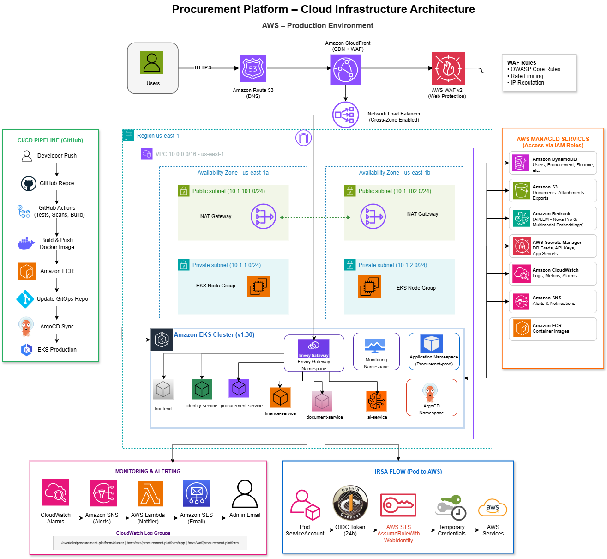

<div align="center">

# Procurement Platform — Infrastructure

[](https://terraform.io)
[](https://aws.amazon.com)
[](https://aws.amazon.com/eks)
[](https://aws.amazon.com/dynamodb)
[](LICENSE)

**Complete AWS infrastructure-as-code** for the Procurement Platform.

Covers VPC, EKS, ECR, ACM, Route53, IAM/IRSA, Secrets Manager, DynamoDB, S3, KMS, CloudWatch,
SNS/Lambda/SES (monitoring alerts), WAF, CloudFront, and cluster add-ons
(AWS Load Balancer Controller, EBS CSI Driver, Metrics Server).

[Organization](https://github.com/ProcurementPlatform) · [App Repo](https://github.com/ProcurementPlatform/procurement-platform-app) · [GitOps Repo](https://github.com/ProcurementPlatform/procurement-platform-gitops)

</div>

---

## Cloud Infrastructure Architecture



---

## AWS Modules Reference

| Module | AWS Resources Created |
|---|---|
| `vpc` | VPC (`10.0.0.0/16`), public + private subnets across 2 AZs, NAT Gateways, route tables, internet gateway |
| `eks` | EKS cluster (v1.30), managed node group, OIDC provider, EKS access entries, security groups |
| `eks-addons` | IAM roles for AWS Load Balancer Controller, EBS CSI Driver, Metrics Server (IRSA) |
| `ecr` | 6 ECR private repositories (`procurement-frontend`, `procurement-identity`, `procurement-procurement`, `procurement-finance`, `procurement-document`, `procurement-ai`) |
| `dynamodb` | 15 DynamoDB tables with GSIs across all services — PAY_PER_REQUEST, KMS encrypted |
| `s3` | Document storage bucket — KMS encrypted, versioning enabled |
| `iam` | IRSA roles for each service (identity, procurement, finance, document, ai, frontend) — least-privilege DynamoDB + S3 + Secrets Manager + Bedrock access |
| `kms` | Customer-managed KMS key for DynamoDB, S3, CloudWatch, SNS encryption |
| `acm` | ACM TLS certificate — DNS-validated via Route53 (account-level singleton) |
| `route53` | Hosted zone for the platform domain (account-level singleton) |
| `cloudfront` | CloudFront distribution fronting the Kgateway NLB — CDN, HTTPS, WAF integration |
| `waf` | AWS WAF v2 web ACL — OWASP Core Rules, rate limiting, IP reputation lists |
| `cloudwatch` | Log groups, EKS control plane logs, metric alarms for EKS + DynamoDB + Lambda |
| `sns` | SNS topic for CloudWatch alarm fan-out |
| `lambda` | Node.js Lambda function — receives SNS alarm, sends email via SES |
| `ses` | SES email identities for sender and recipient (account-level singleton) |
| `bastion` | EC2 bastion host with SSM access (optional — `enable_bastion=true`) |
| `github-oidc-provider` | GitHub OIDC provider (keyless GitHub Actions auth — no stored AWS credentials) |
| `github-oidc-role` | IAM roles for app CI (ECR push) and infra CI (Terraform plan/apply) |

---

## DynamoDB Tables

| Table | Service | GSIs |
|---|---|---|
| `Identity_User` | identity-service | `emailIndex` |
| `Procurement_Vendor` | procurement-service | `vendorCodeIndex`, `vendorEmailIndex` |
| `Procurement_PurchaseRequest` | procurement-service | `prVendorIndex`, `prStatusIndex`, `prRequestedByIndex` |
| `Procurement_PurchaseOrder` | procurement-service | `poNumberIndex`, `poVendorIndex`, `poStatusIndex` |
| `Procurement_Contract` | procurement-service | `contractVendorIndex`, `contractNumberIndex`, `contractStatusIndex` |
| `Finance_Invoice` | finance-service | `invoiceNumberIndex`, `invoiceTypeIndex`, `invoiceStatusIndex`, `invoiceCreatedByIndex` |
| `Finance_Payment` | finance-service | `paymentRefIndex`, `paymentInvoiceIndex`, `paymentVendorIndex`, `paymentStatusIndex` |
| `Finance_Customer` | finance-service | `customerCodeIndex`, `customerEmailIndex`, `customerStatusIndex` |
| `Document_Document` | document-service | `documentCategoryIndex`, `documentRelatedIdIndex` |
| `Document_AuditLog` | document-service | `auditUserIdIndex`, `auditEntityIndex` |
| `Document_Notification` | document-service | `notificationUserIdIndex` |
| `AI_ContractAnalysis` | ai-service | `contractAnalysisDocumentIdIndex`, `contractAnalysisStatusIndex` |
| `AI_Embedding` | ai-service | `embeddingDocumentIdIndex`, `embeddingCategoryIndex`, `embeddingRelatedIdIndex`, `embeddingOwnerVendorIndex` |
| `AI_InvoiceAnalysis` | ai-service | `invoiceAnalysisInvoiceIdIndex`, `invoiceAnalysisRiskLevelIndex` |
| `AI_Feedback` | ai-service | `feedbackFeatureIndex`, `feedbackReferenceIdIndex`, `feedbackUserIdIndex` |

All tables use `PAY_PER_REQUEST` billing and are encrypted with the platform KMS CMK.

---

## Repository Structure

```
procurement-platform-infra/
├── main.tf                        # Root module — wires all modules together
├── variables.tf                   # All input variable declarations
├── outputs.tf                     # IRSA role ARNs, cluster name, zone ID, ACM ARN, etc.
├── providers.tf                   # AWS provider configuration
├── versions.tf                    # Terraform + provider version constraints
├── backend.tf                     # Partial S3 backend config (bucket passed at init time)
├── backend.hcl.example            # Example backend config for init -backend-config
├── dev.tfvars                     # Dev workspace variable values
├── prod.tfvars                    # Prod workspace variable values
├── modules/
│   ├── acm/                       # ACM certificate + DNS validation
│   ├── bastion/                   # EC2 bastion host with SSM
│   ├── cloudfront/                # CloudFront distribution + Route53 alias
│   ├── cloudwatch/                # Log groups + metric alarms
│   ├── dynamodb/                  # All DynamoDB tables with GSIs
│   ├── ecr/                       # ECR repositories
│   ├── eks/                       # EKS cluster + node group + OIDC
│   ├── eks-addons/                # IAM roles for in-cluster add-ons
│   ├── github-oidc-provider/      # GitHub OIDC IdP
│   ├── github-oidc-role/          # GitHub Actions IAM roles
│   ├── iam/                       # IRSA roles for microservices
│   │   └── bedrock.tf             # Bedrock model access policy for ai-service
│   ├── kms/                       # KMS CMK
│   ├── lambda/                    # Alert Lambda + zip packaging
│   │   └── lambda/index.js        # Lambda handler — SNS → SES email
│   ├── route53/                   # Hosted zone
│   ├── s3/                        # Document storage bucket
│   ├── ses/                       # SES email identities
│   ├── sns/                       # SNS alert topic
│   ├── vpc/                       # VPC + subnets + NAT + routing
│   └── waf/                       # WAF v2 web ACL
├── scripts/
│   ├── bootstrap-cluster.sh       # One-time cluster setup (LBC, ArgoCD, Kgateway, monitoring)
│   ├── create-secrets.sh          # Populate Secrets Manager with runtime secrets
│   ├── teardown-cluster.sh        # Clean cluster teardown
│   └── grafana-dashboards/
│       └── procurement-app.json   # Grafana dashboard definition
└── .github/workflows/
    └── terraform-apply.yml        # CI: terraform plan/apply via GitHub OIDC
```

---

## Structure & Workspace Design

Flat root module + `modules/`. No `environments/` folder — `dev` and `prod` are Terraform
workspaces, since the infrastructure is nearly identical between them. Environment-specific values
live in `dev.tfvars` / `prod.tfvars`.

**Account-level singletons** (ECR repositories, ACM certificate, Route53 hosted zone, GitHub OIDC
provider, SES identities) are gated behind `create_global_resources` and created once, in
whichever workspace's first apply you choose. They are never duplicated across workspaces.

> **Important:** Whichever workspace holds the singletons must always pass `create_global_resources=true`
> on every future apply. Passing `false` would instruct Terraform to destroy them —
> `prevent_destroy` on the ACM cert and Route53 zone will block this loudly, but don't rely on it.

---

## Account Portability (Switching AWS Accounts)

The backend bucket name is **not** hardcoded — `backend.tf` is a partial config, and the actual
bucket/region/dynamodb_table come from `-backend-config` flags at init time (see `backend.hcl.example`).
Switching AWS accounts requires only a different init command, not a code edit.

> **S3 bucket names are globally unique across all of AWS** — you cannot reuse the same bucket name
> in a different account, even though DynamoDB table names can repeat freely across accounts.

```bash
# Confirm you are authenticated against the correct account
aws sts get-caller-identity

# Create the remote state bucket and lock table in the new account
aws s3api create-bucket --bucket <new-globally-unique-name> --region us-east-1
aws s3api put-bucket-versioning --bucket <new-globally-unique-name> \
  --versioning-configuration Status=Enabled
aws dynamodb create-table --table-name terraform-state-lock \
  --attribute-definitions AttributeName=LockID,AttributeType=S \
  --key-schema AttributeName=LockID,KeyType=HASH \
  --billing-mode PAY_PER_REQUEST

# Re-initialize with the new backend
terraform init -reconfigure \
  -backend-config="bucket=<new-globally-unique-name>" \
  -backend-config="region=us-east-1" \
  -backend-config="dynamodb_table=terraform-state-lock"
```

In CI, set the `TF_STATE_BUCKET` repository **secret** to the same bucket name —
`terraform-apply.yml` passes it via `-backend-config` at init time.

---

## Applying

```bash
# First workspace — holds the account-level singletons
terraform workspace new dev
terraform apply -var-file=dev.tfvars -var="create_global_resources=true"

# Second workspace — does NOT create the singletons (they already exist account-wide)
terraform workspace new prod
terraform apply -var-file=prod.tfvars
```

A single `terraform apply` is sufficient even on a brand-new cluster — there is no `helm` or
`kubernetes` provider in this repo, so nothing depends on resources that don't yet exist at plan time.

---

## Cluster Add-ons (AWS LBC, EBS CSI Driver, Metrics Server)

IAM roles for the add-ons are created by Terraform (`modules/eks-addons`), but the actual Helm
installs happen in `scripts/bootstrap-cluster.sh` — not as `helm_release` Terraform resources.

Terraform's `helm`/`kubernetes` provider computes its auth token once during `terraform apply`,
which can race an EKS access-entry propagation window on a newly created cluster and fail
("the server has asked for the client to provide credentials"). A separate CLI step re-authenticates
fresh and is not subject to that timing window.

After each environment's apply, run:

```bash
./scripts/bootstrap-cluster.sh <dev|prod>
```

This installs in order:
1. AWS Load Balancer Controller, EBS CSI Driver, Metrics Server (Helm)
2. kube-prometheus-stack (Prometheus + Grafana + Alertmanager)
3. Kgateway + Gateway API CRDs
4. ArgoCD
5. App-of-Apps manifest from [procurement-platform-gitops](https://github.com/ProcurementPlatform/procurement-platform-gitops)

Grafana and Prometheus remain ClusterIP — access them via `kubectl port-forward` commands printed by the script.

---

## Phase 2: Enabling CloudFront

CloudFront fronts the NLB that Kgateway provisions — but the NLB doesn't exist until ArgoCD has
synced the Gateway manifest. CloudFront is therefore always a **second, later apply**:

```bash
# Find the NLB hostname created by Kgateway's Gateway
kubectl get svc -A | grep LoadBalancer

terraform apply -var-file=dev.tfvars -var="create_global_resources=true" \
  -var="enable_cloudfront=true" \
  -var="alb_dns_name=<nlb-hostname-from-above>" \
  -var="acm_certificate_arn=$(terraform output -raw acm_certificate_arn)" \
  -var="route53_zone_id=$(terraform output -raw route53_zone_id)"
```

---

## After First Apply — Delegate DNS

```bash
aws route53 get-hosted-zone \
  --id $(terraform output -raw route53_zone_id) \
  --query 'DelegationSet.NameServers' \
  --output table
```

Update your domain registrar's nameservers to the 4 values returned — the hosted zone only becomes
the authoritative DNS for your domain once the registrar delegates to it.

---

## IRSA Flow (Pod to AWS — No Static Credentials)

```
Pod (with annotated ServiceAccount)
        │
        └── OIDC token issued by EKS (valid 24h, auto-rotated)
                │
                ▼
        AWS STS: AssumeRoleWithWebIdentity
                │
                ▼
        Temporary credentials (scoped to that service's IAM role)
                │
                ├── DynamoDB (service-specific tables only)
                ├── S3 (document bucket)
                ├── Secrets Manager (procurement/{env}/{service}/*)
                └── Bedrock (ai-service only — Nova Pro + Nova Embedding)
```

Each microservice runs with its own `ServiceAccount` annotated with a dedicated IRSA role ARN,
granting least-privilege access. No static AWS credentials are stored in pods, ConfigMaps, or Helm values.

---

## Monitoring & Alerting Pipeline

```
CloudWatch Metric Alarms
(EKS node CPU/memory, DynamoDB throttling, Lambda errors)
        │
        ▼
Amazon SNS Topic (KMS encrypted)
        │
        ▼
AWS Lambda (Node.js — modules/lambda/lambda/index.js)
        │
        ▼
Amazon SES → Admin Email
```

**CloudWatch Log Groups:**

| Log Group | Content |
|---|---|
| `/aws/eks/procurement-platform/cluster` | EKS control plane logs |
| `/aws/eks/procurement-platform/app` | Application container logs |
| `/aws/waf/procurement-platform` | WAF request logs |

---

## CI/CD — Terraform Apply Workflow

`.github/workflows/terraform-apply.yml` triggers on push to `main` and uses the GitHub OIDC role
(keyless auth) to run `terraform plan` then `terraform apply`.

Required GitHub repository secrets:

| Secret | Description |
|---|---|
| `AWS_OIDC_ROLE_ARN` | IRSA role ARN for GitHub Actions CI (created by this Terraform in `create_global_resources`) |
| `TF_STATE_BUCKET` | S3 bucket name for Terraform remote state |

---

## Ubuntu Node AMI (Optional)

`var.use_ubuntu_ami` defaults to `false`. Enabling it switches the node group to Canonical's
EKS-optimized Ubuntu AMI via an SSM parameter lookup.

> **Highest-risk setting in this repo** — verify the AMI resolves before enabling:

```bash
aws ssm get-parameter \
  --name /aws/service/canonical/ubuntu/eks/22.04/1.30/stable/current/amd64/hvm/ebs-gp2/ami-id \
  --region us-east-1
```

If the node group is not `Active` within ~10 minutes, abort and revert by dropping the flag.

---

## Related Repositories

| Repository | Description |
|---|---|
| [procurement-platform-app](https://github.com/ProcurementPlatform/procurement-platform-app) | Backend microservices + React frontend + CI pipeline |
| [procurement-platform-gitops](https://github.com/ProcurementPlatform/procurement-platform-gitops) | Helm chart + ArgoCD Application manifests |

---

## Author & Contributors

| Name | Role | GitHub |
|---|---|---|
| **Vinay Kumar Kondoju** | Owner & Lead Developer | [@KONDOJUVINAYKUMAR08](https://github.com/KONDOJUVINAYKUMAR08) |

---

<div align="center">

**Procurement Platform** — Final Capstone Project

Built with Terraform · AWS EKS · DynamoDB · CloudFront · WAF · ArgoCD

</div>
