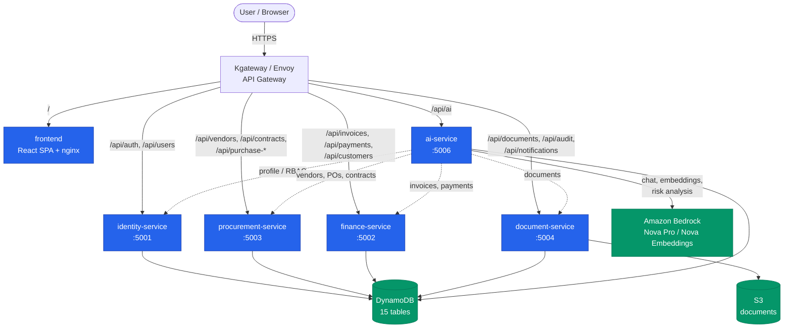
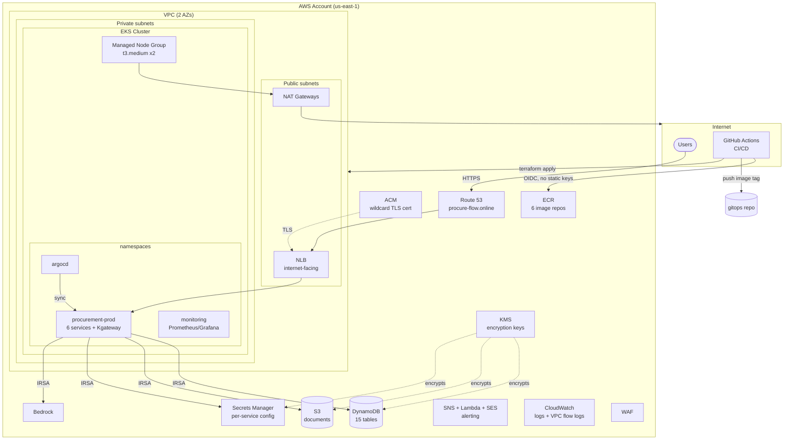
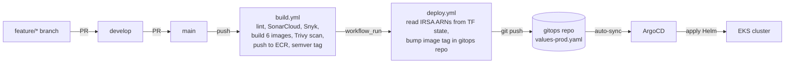

# Procurement Platform — Architecture

A cloud-native procurement management platform: a React SPA + 5 Node.js
microservices, deployed on AWS EKS via GitOps, with AI features powered by
Amazon Bedrock. Split across **3 repositories**:

| Repo | Holds |
|---|---|
| `procurement-platform-app` | Application source (frontend + 5 services), Dockerfiles, build/deploy CI/CD |
| `procurement-platform-infra` | Terraform (AWS infra), cluster bootstrap + secret scripts |
| `procurement-platform-gitops` | Helm chart + ArgoCD Application manifests (desired cluster state) |

> Render the Mermaid diagrams below at https://mermaid.live or with the VS Code
> "Markdown Preview Mermaid" extension to export images for slides.

---

## 1. Application Architecture

Six containers behind a single API gateway. Each service owns its own data
(DynamoDB tables) and exposes a REST API under `/api`. Only the AI service calls
other services; everyone else is independent.

**Services:**
- **identity-service** — auth (bcrypt + JWT), users. Signs the JWT every other service verifies.
- **procurement-service** — vendors, contracts, purchase requests, purchase orders.
- **finance-service** — invoices (GST/TDS), payments, customers.
- **document-service** — document upload/download (S3), audit logs, notifications.
- **ai-service** — Procurement Copilot (chat), contract intelligence, invoice risk analysis, document semantic search. Aggregates data from the other 4 services over REST and reasons over it with Bedrock.
- **frontend** — React SPA served by nginx; all API calls go through the gateway at `/api`.

**Auth flow:** identity-service signs a JWT with a shared secret (from Secrets
Manager); every service verifies it with the same secret via shared middleware.
RBAC roles: `admin`, `procurement_manager`, `finance`, `auditor`, `vendor`, `employee`.

---

## 2. AWS Infrastructure Architecture

**Key infrastructure decisions:**
- **2 Availability Zones** — EKS requires a minimum of 2; keeps NAT/subnet cost down vs 3.
- **NLB (not ALB)** — provisioned by the AWS Load Balancer Controller from Kgateway's Gateway. TLS terminates at the NLB using the ACM wildcard cert.
- **IRSA (IAM Roles for Service Accounts)** — each service's pod assumes a scoped IAM role via the cluster's OIDC provider; no static AWS keys in the cluster.
- **OIDC for CI/CD** — GitHub Actions assumes an AWS role via OIDC federation; no long-lived secrets in GitHub.
- **KMS everywhere** — DynamoDB, S3, Secrets Manager, SNS, CloudWatch logs all encrypted with customer-managed keys.
- **Secrets Manager** — per-service runtime config (JWT secret, model IDs, bucket names); fetched by each service at startup. Never in Terraform state.
- **Account-level singletons** (ECR, ACM, Route53, OIDC provider, DynamoDB, KMS) are `prevent_destroy`-guarded and created once via a `create_global_resources` flag.

---

## 3. CI/CD & GitOps Flow

- **App repo** (`build.yml` → `deploy.yml`): builds/scans/pushes images, then bumps the image tag in the gitops repo's Helm values.
- **GitOps repo**: ArgoCD watches it and auto-syncs any change to the cluster (Helm chart = single source of truth for cluster state).
- **Infra repo** (`terraform-apply.yml`): plan → manual approval → apply, with tfsec scanning.
- **Branching**: `main ← develop ← feature/*` across all 3 repos. Semantic versioning on `main` (`feat!:` → major bump).

---

## 4. Security & Observability

- **NetworkPolicies** — default-deny in `procurement-prod`, with explicit allows only for real traffic paths (Gateway→service, ai-service→its 4 peers, DNS, AWS APIs). Enforced by the AWS VPC CNI's native policy engine.
- **Scanning** — tfsec + Checkov (Terraform), SonarCloud + Snyk (app code/deps), Trivy (container images).
- **Monitoring** — kube-prometheus-stack: Prometheus scrapes cluster + app `/metrics` (via ServiceMonitors), Grafana dashboards (cluster + custom app RED-metrics dashboard), Alertmanager → Slack.
- **Alerting** — CloudWatch alarms → SNS → Lambda → SES email; plus Alertmanager → Slack for cluster alerts.
- **Audit** — every mutating action writes a `Document_AuditLog` entry; VPC flow logs + EKS control-plane logs to CloudWatch.
